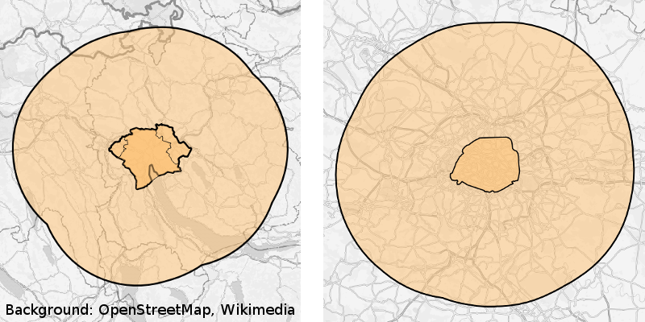

# eqasim-java


This repository contains all the Java (and MATSim) related parts of eqasim.
Especially, it contains the standardized code to run the simulation and to cut
smaller regions from the reference scenarios.

The general workflow to run a reference scenario is as follows:
- Generate a scenario (using the respective scenario pipeline)
- Run the simulation (using this repository)

Currently, there are two scenario pipelines: Switzerland and Île-de-France.

Once a reference scenario exists (and has been run for a sufficient number of
iterations, we recommend 40) it is possible to cut out a smaller region. The
workflow for that is as follows:
- Run the reference scenario for 40 iterations
- Cut the smaller scenario based on the output population
- Run the smaller simulation

All of these steps can be performed with this repository. A more detailed guide
through the steps outlined above is given in the following sections.

## How to generate a reference scenario

Currently, there are two pipelines that generate reference scenarios. One is for
Switzerland and Île-de-France. At the moment, each of them has a separate
repository and a lot of code duplication is going on, which is subject to be
improved soon. Nevertheless, the pipelines can be run in almost the same way.

The links to the pipeline repositories are:
- Switzerland: https://gitlab.ethz.ch/ivt-vpl/populations/ch-zh-synpop
- Île-de-France: https://gitlab.ethz.ch/ivt-vpl/populations/idf-paris-synpop

Please follow the instructions from the Switzerland pipeline in both cases. The
first step is to set up an environment with Java, Maven, Python, etc. and then
to run the scenario synthesis. In each case, you need a pipeline configuration,
which should looks as follows.

For Switzerland, such a configuration should be sufficient:
```yml
# switzerland.yml

raw_data_path: /nas/ivtmatsim/scenarios/switzerland/data
target_path: /path/to/my/custom/cache/directory

output_path: /path/to/my/custom/output/directory
output_id: switzerland_10pct

input_downsampling: 0.1
use_freight: true

java_memory: 300G
threads: 24
hot_deck_matching_runners: 24

stages:
    - matsim.final
```

By running `python3 run.py switzerland.yml` the pipeline should create a new folder
called `switzerland_10pct` in the specified output folder after processing all
the data. Note that the paths need to be adjusted accordingly. Also, this example
assumes the standard IVT path for the raw input data. In another set up this
may need to be changed. Using the `output_id` the name of the output folder can
be specified and the `input_downsampling` setting defines the sample size (in
this case, 10% was chosen). Note that it makes sense to remove all contents of
the cache directory if you attempt to create a new sample size, because several
stages in the process would need to be generated.

For Île-de-France the process is similar, but the settings file looks slightly
different. A template is this one:

```yml
# ile_de_france.yml

raw_data_path: /nas/ivtmatsim/scenarios/paris/data

target_path: /path/to/my/custom/cache/directory
output_path: /path/to/my/custom/output/directory
output_id: ile_de_france_10pct

input_downsampling: 0.1
hts: egt

java_memory: 300G
threads: 24
hdm_threads: 24

stages:
    - matsim.final
```

Again, `python3 run.py ile_de_france.yml` should generate the scenario.

## Running a simulation

Suppose there is a freshly generated scenario. The only
thing that is necessary to run the scenario is to use the `RunSimulation` script
in this repository.

The script can either be started directly in Eclipse/IntelliJ, or from a Maven
build. To create a Maven build of the repository, you first have to clone it:

    git clone https://github.com/eqasim-org/eqasim-java.git

Then you have to enter the directory and package it:

    cd eqasim-java
    mvn -Pstandalone package

It is important to keep the `-standalone` flag, because it creates a full jar
with all the libraries needed. The `eqasim` Maven project is a multi-module
project. All general purpose classes are located in `org.eqasim.core`. Additionally,
there are two scenario-specific modules called `org.eqasim.switzerland` and
`org.eqasim.ile_de_france`. For each of them a separate jar will be created. They
are located at:

    eqasim-java/switzerland/target/switzerland-1.0.0.jar
    eqasim-java/ile_de_france/target/ile_de_france-1.0.0.jar

Both of the scenario-specific modules contain the aforementioned `RunSimulation` class
for their respective use cases. Hence, to run the simulation from the command
line, one needs to call:

```bash
java -Xmx100G -cp /path/to/switzerland-1.0.0.jar org.eqasim.switzerland.RunSimulation --config-path /path/to/switzerland_config.xml
```
or

```bash
java -Xmx100G -cp /path/to/ile_de_france-1.0.0.jar org.eqasim.ile_de_france.RunSimulation --config-path /path/to/ile_de_france_config.xml
```

This should start the simulation according to what is given in the respective
config file.

## Cutting a scenario

In order to cut a scenario, it is possible to call the respective script from
Eclipse/IntelliJ, or from the command line. In the latter case, please follow
the instructions from the section above to package a jar file.

The relevant run script is then `org.eqasim.scenario.cutter.RunScenarioCutter`.
Note that either the `switzerland` or `ile_de_france`
jar can be used. Since the script is located in the `core` package, there is no
scenario-specific functionality in the cutter. We simply don't create an additional
jar for the `core` package since all the functionality is automatically included in
the scenario-specific jars.

The script expects a number of arguments:

```bash
java -Xmx100G -cp /path/to/switzerland-1.0.0.jar org.eqasim.core.scenario.cutter.RunScenarioCutter
--config-path /path/to/ile_de_france_config.xml
--output-path /path/to/output/paris_10pct
--extent-path /path/to/paris_shapefile.shp
--config:plans.inputPlansFile /path/to/output_plans.xml.gz
--prefix paris_
--threads 24
```

First, the path to the reference scenario must be given by providing its config
file. Second, an output path needs to be specified. Third, the path to a shape file
must be provided. This shape file determines the extent of the cut region. Make
sure that it is a compact shape without holes. The shape file should only contain
a single polygon feature. Finally, a prefix can be specified that defines according
to which pattern files will be written to the output folder. In this case, we would
have a `paris_population.xml.gz`, `paris_facilities.xml.gz`, etc.

The generated scenario can then be run. For that, you can use the same scripts
as for the reference sceanrio. If you cut a Zurich scenario from Switzerland,
the `switzerland` module can still be used to run the scenario. The same goes
for the Paris / Ile-de-France case.

To get started, the `gis/` folder in this repository contains a number of common
shape files:
- `zurich_city.shp` The 12 districts of Zurich city
- `zurich.shp` Zurich city and several high density areas in the surroundings
- `zurich_20km.shp` Zurich city and surroundings, plus a 20km buffer
- `paris.shp` City area of Paris (20 arrondissements)
- `paris_20km.shp` City area of Paris, plus a 20km buffer

Note that the shape files must be given in the correct projection. For Switzerland
this is `EPSG:2056` and for France it is `EPSG:2154`.



## Contributing

This repository makes use of the (GitFlow)[https://nvie.com/posts/a-successful-git-branching-model/] repository model. This means that development is taking place in the `develop` branch, while the current production version can be found in the `master` branch. To contribute, please send a pull request to `develop`.
